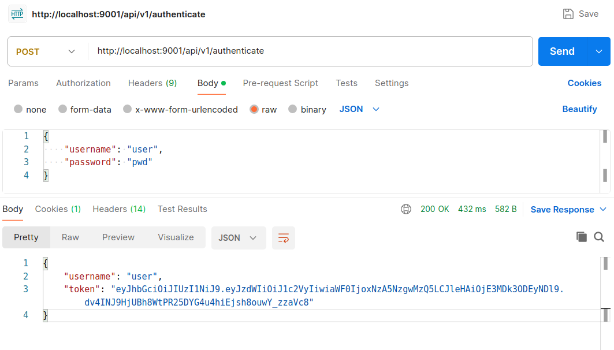

DEMO JWT AUTHENTICATION
--------------------------------------------------------------------------------------------------------------------

Application created with Spring Boot 3.2.3 and Java 17.

This Rest API returns a JWT Token when a user authenticates.

--------------------------------------------------------------------------------------------------------------------

This app uses Web, Spring Security, JWT and Lombok dependencies:

```
    <dependency>
        <groupId>org.springframework.boot</groupId>
        <artifactId>spring-boot-starter-web</artifactId>
    </dependency>

    <dependency>
        <groupId>org.springframework.boot</groupId>
        <artifactId>spring-boot-starter-security</artifactId>
    </dependency>

    <dependency>
        <groupId>io.jsonwebtoken</groupId>
        <artifactId>jjwt-api</artifactId>
        <version>0.11.5</version>
    </dependency>

    <dependency>
        <groupId>io.jsonwebtoken</groupId>
        <artifactId>jjwt-impl</artifactId>
        <version>0.11.5</version>
    </dependency>

    <dependency>
        <groupId>io.jsonwebtoken</groupId>
        <artifactId>jjwt-jackson</artifactId>
        <version>0.11.5</version>
    </dependency>
    
    <dependency>
        <groupId>org.projectlombok</groupId>
        <artifactId>lombok</artifactId>
        <optional>true</optional>
    </dependency>		

```


--------------------------------------------------------------------------------------------------------------------

Call to authentication endpoint with Postman, which returns the JWT Token:




--------------------------------------------------------------------------------------------------------------------
